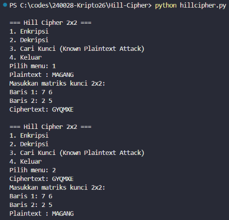
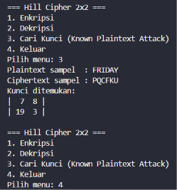

# Program Kriptografi: Hill Cipher (Ordo 2x2)

Program implementasi algoritma **Hill Cipher 2x2** berbasis Python yang mendukung tiga fungsionalitas utama: **Enkripsi**, **Dekripsi**, dan **Pencarian Kunci (Known-Plaintext Attack)**.

---

## 1. Alur & Struktur Program

Program bekerja dengan memanfaatkan operasi matriks dalam aritmatika modulo 26:

### A. Modular Invers & Extended Euclidean Algorithm (`egcd`, `mod_inv`)
* Menghitung nilai invers modulo dari integer `a (mod 26)` menggunakan Extended Euclidean Algorithm.
* Memastikan nilai determinan memenuhi `gcd(det(M), 26) = 1`. Jika tidak bernilai 1, matriks tidak memiliki invers di modulo 26.

### B. Invers Matriks 2x2 Modulo 26 (`get_inv_matrix`)
* Menghitung determinan matriks M: `det(M) = (a*d - b*c) mod 26`.
* Menghitung invers determinan di modulo 26.
* Membentuk matriks Adjoin:
  ```text
  Adj(M) = [  d  -b ]
           [ -c   a ] (mod 26)
  ```
* Menghitung matriks invers: `M^-1 = (det^-1 * Adj(M)) mod 26`.

### C. Fungsionalitas Operasi
* **Enkripsi (`encrypt`):**
  * Memfilter input (hanya alfabet kapital).
  * Menambahkan padding `X` jika panjang karakter ganjil.
  * Membagi teks menjadi vektor kolom 2x1 dan mengalikannya dengan matriks kunci K: `C = K * P (mod 26)`.
* **Dekripsi (`decrypt`):**
  * Menghitung matriks invers kunci `K^-1 (mod 26)`.
  * Mengalikan setiap blok ciphertext dengan `K^-1`: `P = K^-1 * C (mod 26)`.
* **Pencarian Kunci (`find_key`):**
  * Menggunakan metode Known-Plaintext Attack dari minimal 4 karakter (2 blok kolom 2x1).
  * Menyusun matriks P dan C berukuran 2x2.
  * Menghitung kunci K dengan formula: `K = C * P^-1 (mod 26)`.
  * Melakukan iterasi kombinasi blok untuk memastikan determinan matriks P relatif prima terhadap 26.

---

## 2. Cara Menjalankan Program

Pastikan Python 3 sudah terpasang, lalu jalankan perintah berikut di terminal:

```bash
cd Hill-Cipher
python hillcipher.py
```

Pilih menu yang tersedia di terminal:
* **1** : Enkripsi plaintext
* **2** : Dekripsi ciphertext
* **3** : Cari kunci dari sampel plaintext & ciphertext
* **4** : Keluar dari program

---

## 3. Screenshot Running Program

### A. Pengujian Enkripsi & Dekripsi
Pengujian menggunakan teks `MAGANG` dengan matriks kunci:
```text
K = | 7  6 |
    | 2  5 |
```
* **Enkripsi:** `MAGANG` -> `GYQMXE`
* **Dekripsi:** `GYQMXE` -> `MAGANG`



### B. Pengujian Pencarian Kunci (Known-Plaintext Attack)
Pengujian pencarian kunci menggunakan sampel valid:
* **Plaintext:** `FRIDAY`
* **Ciphertext:** `PQCFKU`
* **Hasil Kunci Ditemukan:**
```text
K = |  7   8 |
    | 19   3 |
```


